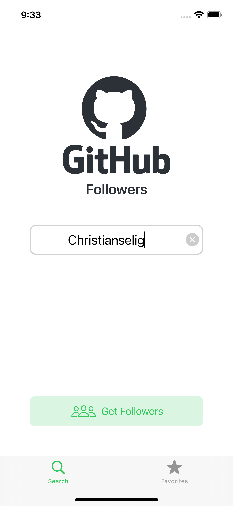
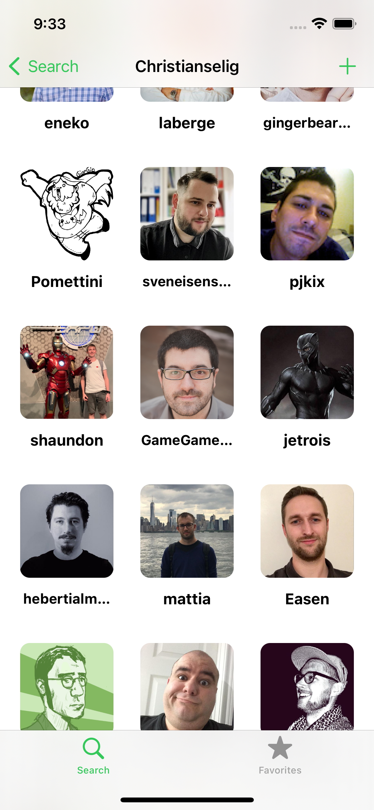
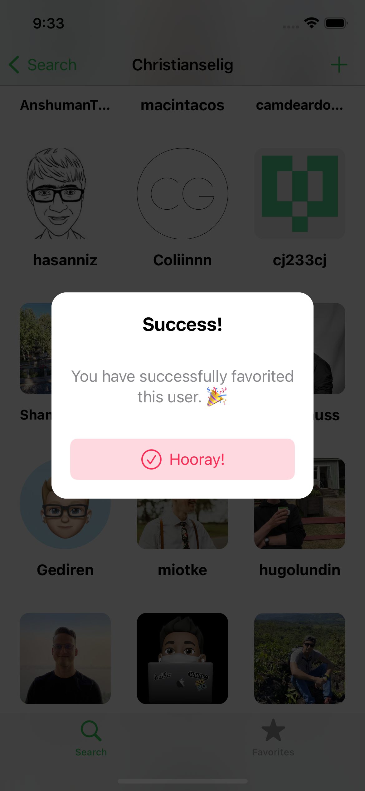
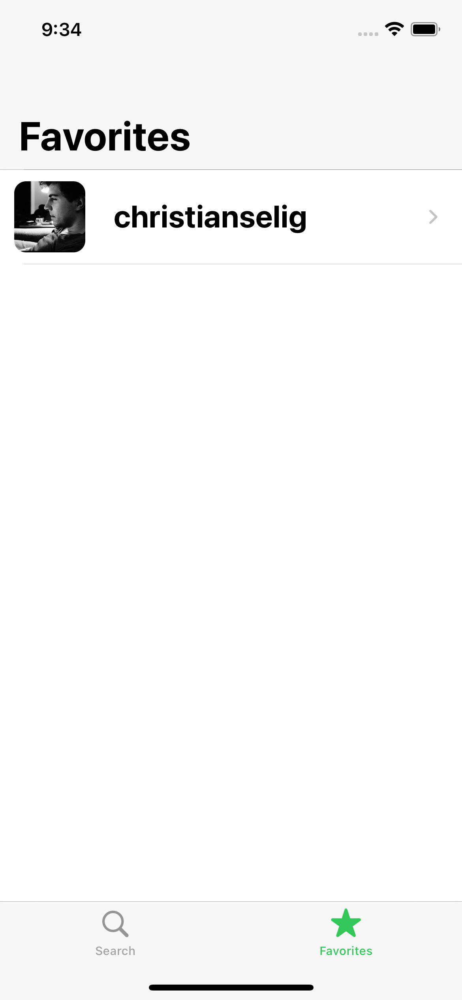

# Github Followers

This was such a good course! I learned a lot about Auto Layout, the iOS App Lifecycle, caching, making network requests, error handling, light/dark mode, and many more topics! 
This course really gave me that solid foundation for building iOS apps.

This app essentially will get the followers of a Github User and display them in a pretty format. You can also "favorite" the developer you like the most.

